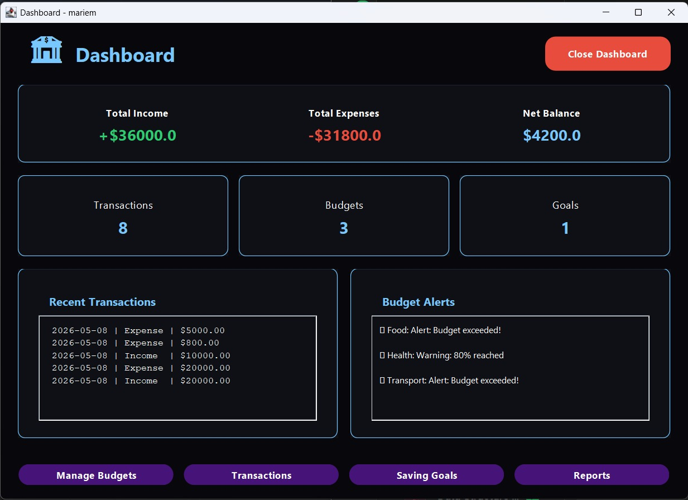

# 💸 Personal Budget Tracker

<p align="center">
  
</p>

A desktop-based financial management application designed to help users efficiently track their income, expenses, and overall budget in a simple and organized way.

The system provides an interactive and user-friendly experience that enables users to manage their personal finances and monitor spending habits effectively.

---

## ✨ Key Features

* Secure User Login & Registration  
* Add and Manage Financial Transactions  
* Track Income and Expenses  
* Remaining Balance Calculation  
* Financial Reports & Budget Monitoring  
* Interactive Dashboard  
* Clean and Easy-to-Use Interface  

---

## 🛠️ Technologies Used

* Java  
* Java Swing  
* Object-Oriented Programming (OOP)  
* File Handling  

---

## 📂 Project Structure

```bash
src/
│── controller/
│── model/
│── repository/
│── service/
│── ui/
└── Main.java

## 👩‍💻 Team Members

- The Project  
- Mariem Badawy  
- Sama Sameh  
- Nour Ahmed

## 📌 Project Purpose

This project was developed as part of a software development learning experience to practice:

* Java Programming  
* GUI Development  
* Object-Oriented Programming (OOP) Principles  
* Software Architecture  
* Problem Solving & Team Collaboration  
