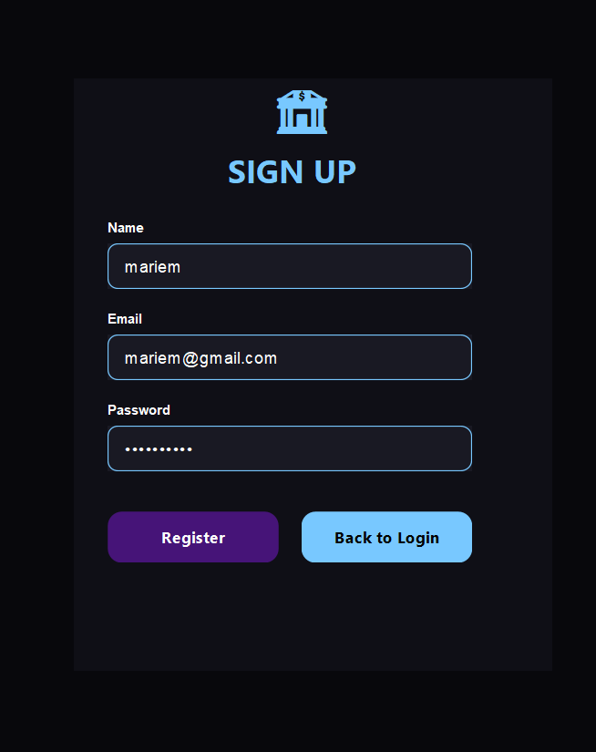
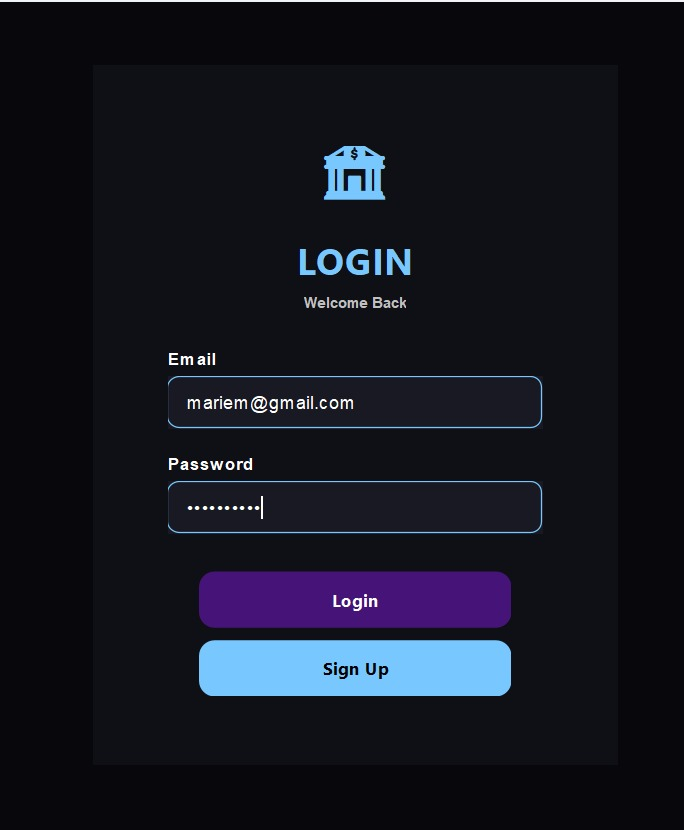
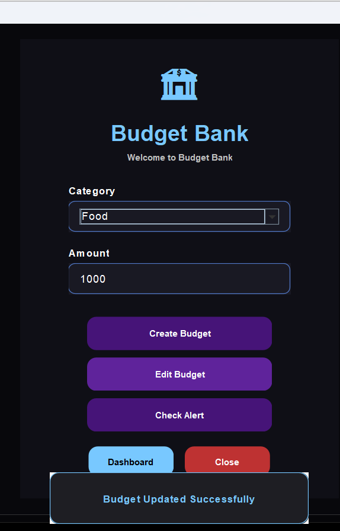
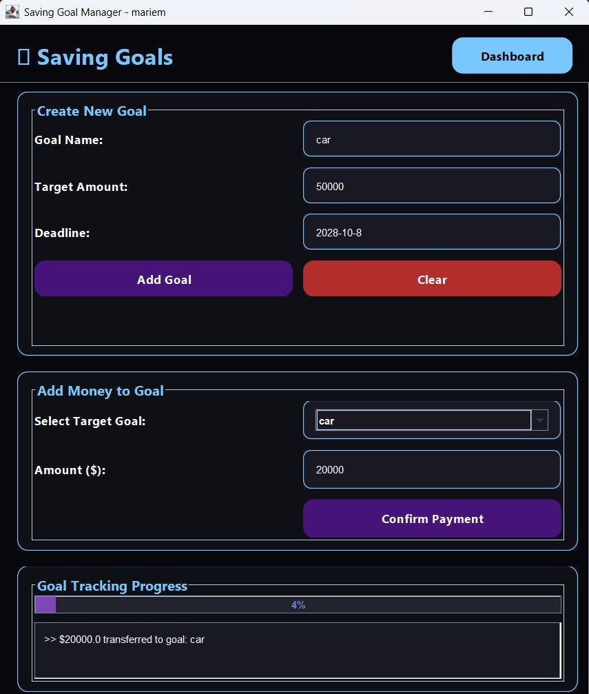
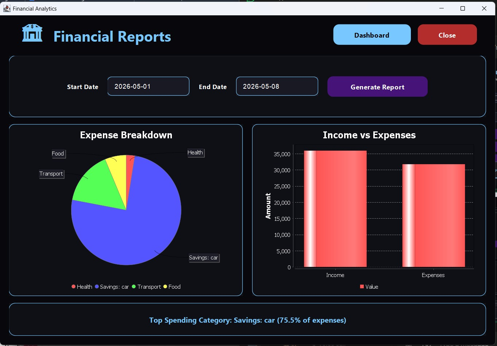

# Personal Finance Management System

A Java Swing desktop application for managing personal finances.

## Features

- User Authentication
- Dashboard Analytics
- Budget Management
- Transaction Tracking
- Savings Goals
- Financial Reports
- Charts & Insights

## Technologies Used

- Java
- Java Swing
- OOP
- File Handling
- JFreeChart

## Project Supervisor

Dr. Mohamed El-Ramly

## Screenshots
### Sign Up

### Login Screen

### Budget Screen

### Saving Goals

### Dashboard

### Reports

